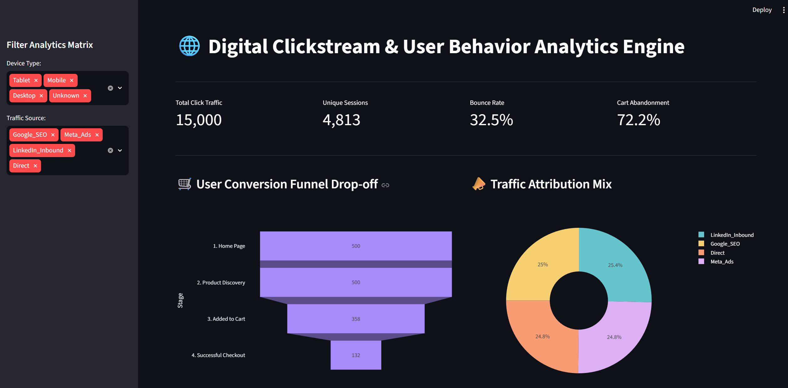

# 🌐 Digital Clickstream & User Behavior Analytics Engine



An end-to-end data analytics and engineering pipeline that simulates, cleans, transforms, and visualizes high-velocity website event logs. This project models user behavior journeys to calculate core e-commerce performance metrics like conversion funnels, session boundaries, and drop-off leakage.

---

## 🛠️ The Tech Stack & Architecture

* **Data Extraction & Simulation:** Python (Randomized Behavioral Logic)
* **Data Transformation (ETL):** Python, Pandas
* **Analytical Storage:** Structured CSV Matrix (Schema-ready for OLAP Engines like DuckDB/PostgreSQL)
* **BI Dashboard Platform:** Streamlit, Plotly Express

---

## 🏗️ Data Engineering & ETL Pipeline

The raw clickstream dataset handles thousands of high-velocity tracking events but contains real-world data anomalies. The engineering layer (`scripts/clean_and_transform.py`) automatically executes the following data cleaning procedures:

1. **Deduplication:** Identifies and purges exact duplicate tracking records to preserve transaction accuracy.
2. **Imputation:** Normalizes missing categorical data arrays by identifying empty device logs and flagging them as `"Unknown"`.
3. **Sessionization & Sequencing:** Parses chronological event timestamps and calculates a cumulative sequence count (`session_step_sequence`) partitioned by each unique user session. This enables strict step-by-step conversion funnel tracking.

---

## 📊 Business Intelligence & Actionable Insights

The analytical dashboard tracks user interactions dynamically, translating thousands of log pings into executive KPIs:

* **Traffic Integrity:** Processes over 15,000 baseline interactions down to roughly 4,800 highly distinct user sessions.
* **Top-of-Funnel Conversion:** Product discovery exhibits a flawless 100% progression rate from the initial landing home page to sub-category lists.
* **Funnel Drop-Off Friction:** Identified a major operational bottleneck at the cart stage with an **Abandonment Rate of ~72%**. This quantitative insight indicates technical or structural user friction during the checkout screen flow, providing an immediate area for business optimization.

---

## 🚀 How to Run the Environment Locally

### 1. Initialize Requirements
```bash
pip install pandas streamlit plotly

Execute Ingestion & Transformation Scripts
python scripts/generate_clicks.py
python scripts/clean_and_transform.py

Launch the Interactive Dashboard
python -m streamlit run app.py

